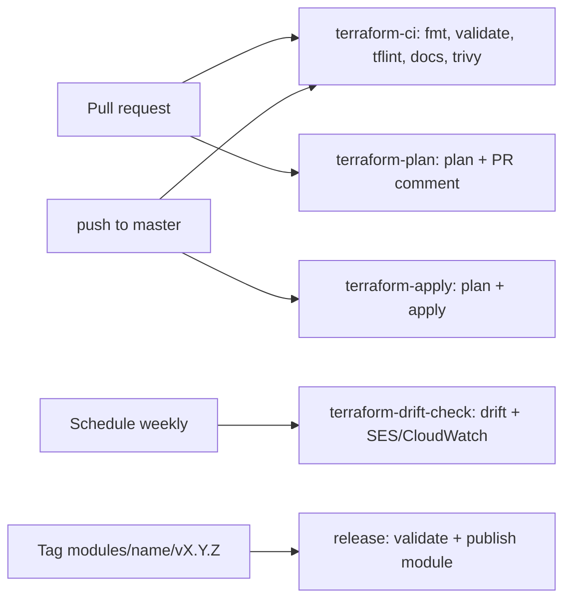

# Terraform CORS Project

[](https://github.com/mahesh2121/Terraform_cors_project/actions/workflows/terraform-ci.yml)
[](https://github.com/mahesh2121/Terraform_cors_project/actions/workflows/terraform-plan.yml)
[](https://github.com/mahesh2121/Terraform_cors_project/actions/workflows/terraform-apply.yml)
[](LICENSE)

Standardized, reusable Terraform modules for hosting cross-origin (CORS)
resources — an **AWS S3 static website** and an **Azure App Service web app** —
fully governed by a CI/CD pipeline (fmt → validate → lint → security scan →
plan → apply → drift detection → release).

## Modules

| Module | Cloud | Description |
| ------ | ----- | ----------- |
| [`modules/s3-cors-website`](modules/s3-cors-website) | AWS | S3 bucket as a public static website with configurable CORS rules, versioning, bucket policy and content upload |
| [`modules/azure-webapp-cors`](modules/azure-webapp-cors) | Azure | App Service web app (**Linux & Windows**) with CORS, private endpoint + private DNS zone, Microsoft Entra authentication and managed identity |

Every module follows the [standard module layout](AGENTS.md): `versions.tf`,
`variables.tf`, `main.tf`, `outputs.tf` and a terraform-docs generated
`README.md`, with validated inputs, documented outputs and version-pinned
providers.

## Examples

| Example | Description |
| ------- | ----------- |
| [`examples/s3-cors-website`](examples/s3-cors-website) | Deploys the S3 CORS module with a test page (`www/index.html`) that proves CORS works across origins |
| [`examples/azure-webapp-cors`](examples/azure-webapp-cors) | Deploys a **Windows** web app with private endpoint + private DNS, Entra auth, managed identity and restrictive CORS origins |

## Repository structure

```text
.
├── .github/
│   ├── workflows/            # CI/CD pipelines (see below)
│   ├── ISSUE_TEMPLATE/       # Bug & feature request templates
│   ├── CODEOWNERS
│   ├── PULL_REQUEST_TEMPLATE.md
│   └── dependabot.yml
├── modules/                  # Reusable, versioned Terraform modules
│   ├── s3-cors-website/
│   └── azure-webapp-cors/
├── examples/                 # Runnable root modules consuming the modules
│   ├── s3-cors-website/
│   └── azure-webapp-cors/
├── scripts/                  # Drift notification helpers used by CI
├── AGENTS.md                 # Standards for AI coding agents & contributors
├── CONTRIBUTING.md
├── SECURITY.md
├── Makefile                  # fmt / validate / lint / docs / security targets
├── .pre-commit-config.yaml
├── .tflint.hcl
└── .terraform-docs.yml
```

## CI/CD pipeline

| Workflow | Trigger | Purpose |
| -------- | ------- | ------- |
| [`terraform-ci.yml`](.github/workflows/terraform-ci.yml) | PR / push | Auto-discovers every module & example and runs `terraform fmt`, `init`, `validate`, `tflint`, terraform-docs check and a Trivy (tfsec) security scan |
| [`terraform-plan.yml`](.github/workflows/terraform-plan.yml) | PR | Runs `terraform plan` for both examples and posts it as a PR comment (skipped when cloud credentials are not configured) |
| [`terraform-apply.yml`](.github/workflows/terraform-apply.yml) | push to `master` / manual | Plan + apply the examples against the `production` environment; manual runs can `plan`, `apply` or `destroy` |
| [`terraform-drift-check.yml`](.github/workflows/terraform-drift-check.yml) | weekly + manual | Detects configuration drift, emails via SES and logs to CloudWatch |
| [`release.yml`](.github/workflows/release.yml) | tag `modules/<name>/v*` | Validates and packages a module into a GitHub Release |



## Quick start

```sh
git clone https://github.com/mahesh2121/Terraform_cors_project.git
cd Terraform_cors_project

# AWS example
cd examples/s3-cors-website
cp terraform.tfvars.example terraform.tfvars    # edit bucket name (must be unique)
cp backend.s3.hcl.example backend.s3.hcl        # edit state backend
terraform init -backend-config=backend.s3.hcl
terraform plan
terraform apply
```

### Required CI secrets & variables

| Secret / Variable | Workflows | Notes |
| ----------------- | --------- | ----- |
| `AWS_ACCESS_KEY_ID`, `AWS_SECRET_ACCESS_KEY` | plan / apply | Plans run on PRs; apply on `master` |
| `TF_STATE_BUCKET`, `TF_STATE_KEY`, `TF_STATE_LOCK_TABLE` | plan / apply / drift | S3 backend for the AWS example |
| `ROLE_ARN` | drift | OIDC role for the scheduled drift check |
| `SENDER_EMAIL`, `RECIPIENT_EMAIL` | drift | SES drift notifications |
| `AZURE_CLIENT_ID`, `AZURE_TENANT_ID`, `AZURE_SUBSCRIPTION_ID` | plan / apply | Azure OIDC login |
| `TF_STATE_RESOURCE_GROUP_NAME`, `TF_STATE_STORAGE_ACCOUNT_NAME`, `TF_STATE_CONTAINER_NAME` | plan / apply | azurerm state backend |
| `AWS_REGION` (variable) | plan / apply / drift | Defaults to `ap-south-1` |

Jobs that need credentials are **skipped automatically** when the secrets are
absent, so the repository stays green without cloud access.

## Developing modules

See [CONTRIBUTING.md](CONTRIBUTING.md) for the full workflow and
[AGENTS.md](AGENTS.md) for the module standards coding agents must follow.
Quick reference:

```sh
pre-commit install       # run quality gates on every commit
make fmt-check           # terraform fmt -check
make validate            # init -backend=false + validate (all dirs)
make lint                # tflint (all dirs)
make docs                # regenerate module READMEs (terraform-docs)
make security            # trivy (tfsec) scan
```

## Security

Please report vulnerabilities privately — see [SECURITY.md](SECURITY.md).

## License

[Apache License 2.0](LICENSE)
